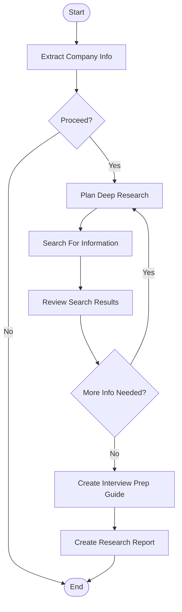
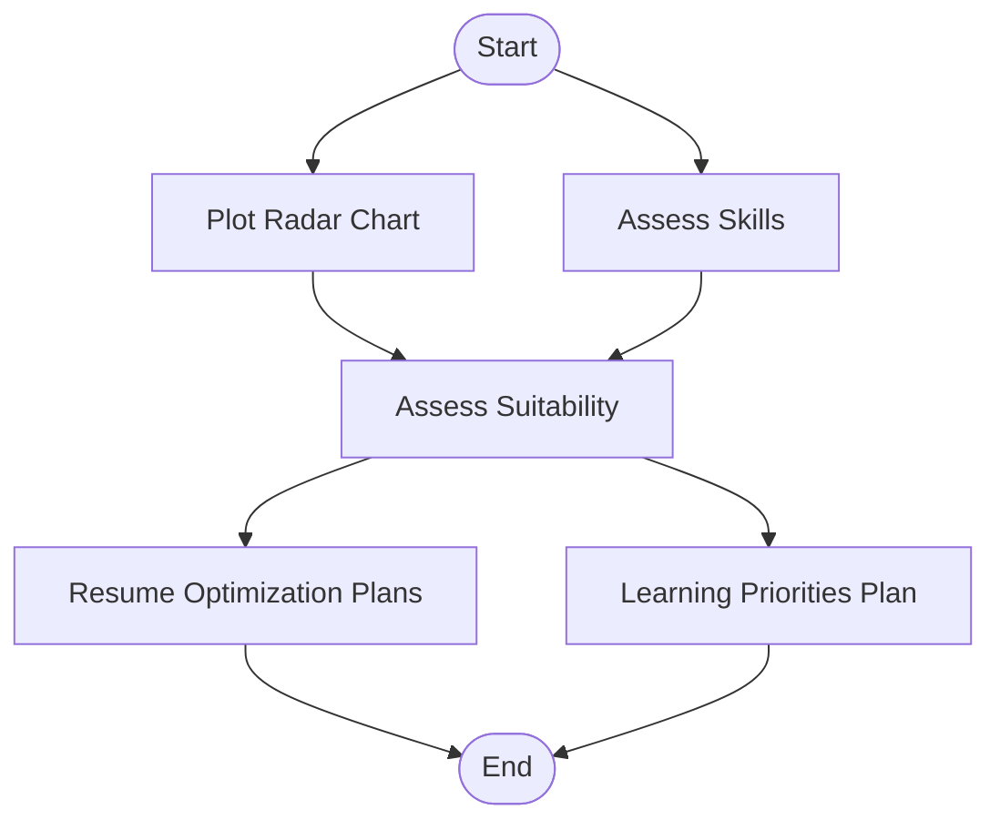

## Deep Research Workflow

```mermaid
graph TD
    Start([Start]) --> EXTRACT_COMPANY_NAME_AND_JOB_TITLE[Extract Company Info]
    EXTRACT_COMPANY_NAME_AND_JOB_TITLE --> CheckProceed{Proceed?}
    CheckProceed -- Yes --> PLAN_DEEP_RESEARCH[Plan Deep Research]
    CheckProceed -- No --> End([End])
    PLAN_DEEP_RESEARCH --> SEARCH_FOR_INFORMATION[Search For Information]
    SEARCH_FOR_INFORMATION --> REVIEW_SEARCH_RESULTS[Review Search Results]
    REVIEW_SEARCH_RESULTS --> CheckRegenerate{More Info Needed?}
    CheckRegenerate -- Yes --> PLAN_DEEP_RESEARCH
    CheckRegenerate -- No --> CREATE_INTERVIEW_PREP_GUIDE[Create Interview Prep Guide]
    CREATE_INTERVIEW_PREP_GUIDE --> CREATE_RESEARCH_REPORT[Create Research Report]
    CREATE_RESEARCH_REPORT --> End
```

## Analyze Fit Workflow

```mermaid
graph TD
    Start([Start]) --> plotRadarChart[Plot Radar Chart]
    Start --> assessSkills[Assess Skills]
    plotRadarChart --> assessSuitability[Assess Suitability]
    assessSkills --> assessSuitability
    assessSuitability --> resumeOptimizationPlans[Resume Optimization Plans]
    assessSuitability --> learningPrioritiesPlan[Learning Priorities Plan]
    resumeOptimizationPlans --> End([End])
    learningPrioritiesPlan --> End
```
