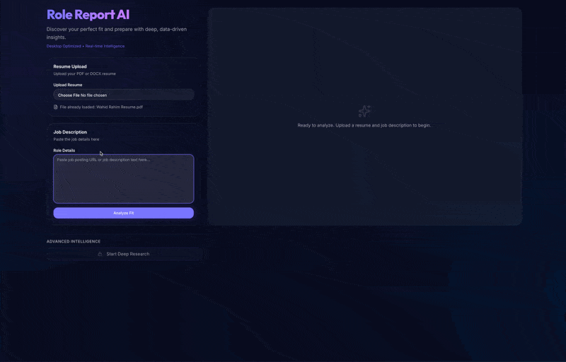
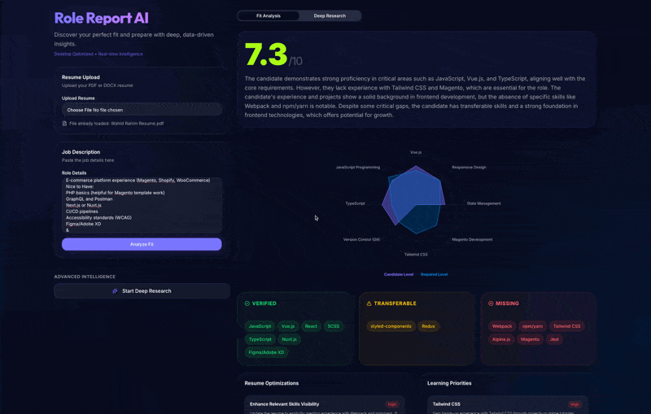
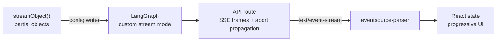
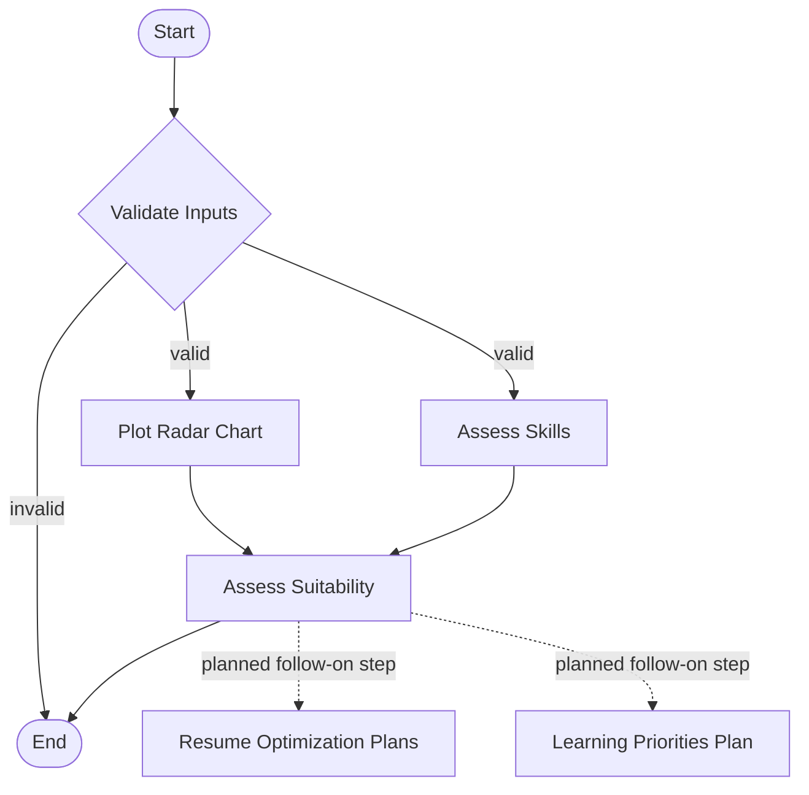
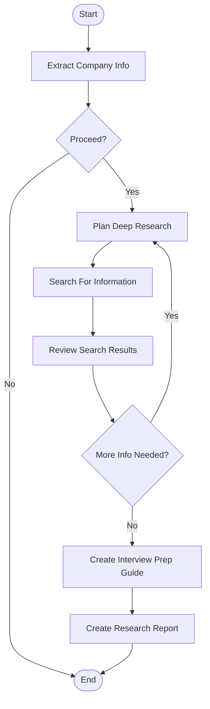

# Role Report AI

**Multi-step LLM workflows with LangGraph, streamed live into a React UI — typed partial objects, node by node.**

[**Live demo →**](https://role-report-ai.vercel.app/)

The app compares a resume against a job description and produces a structured fit analysis: a competency radar chart, an evidence-based skill assessment, and a suitability verdict — with an optional deep-research workflow that gathers company and role intelligence from the web and generates interview prep artifacts.

The app is the vehicle. The engineering focus is what's underneath: graph-orchestrated LLM pipelines with end-to-end structured streaming, exposed over three transports (streaming HTTP, MCP over HTTP, MCP over stdio).

## What this demonstrates

- **Graph-orchestrated workflows** — LangGraph `StateGraph`s with parallel fan-out/fan-in, conditional routing, and an iterative research loop (plan → search → review → re-plan until sufficient)
- **End-to-end structured streaming** — each node streams **typed partial objects** (AI SDK `streamObject`) through LangGraph's custom stream mode, over SSE with abort propagation, into React state — the UI renders every analysis section as the model writes it, not after
- **Schema guardrails at every boundary** — an input-validation gate before the graph runs, Zod schemas on every model output, and normalization for common enum drift (models love inventing `"strongly preferred"`)
- **One workflow, three transports** — the analyze graph is served as a streaming HTTP endpoint (`/api/analyze`), as an MCP tool over streamable HTTP (`/api/mcp`), and as a standalone MCP stdio server for clients like Claude Code
- **Tiered model routing** — `fast` / `balanced` / `powerful` model tiers assigned per node, with prompt caching on the large system prompts

## Demos

### Analyze



### Deep Research



## Architecture

### The streaming pipeline

Every analysis section streams incrementally from model to UI:



Inside each node, the AI SDK's `partialObjectStream` yields progressively complete objects validated against a Zod schema. Those partials are forwarded through LangGraph's `config.writer` (custom stream mode), framed as named SSE events by the API route, parsed on the client, and reduced into per-section React state. Aborting the request propagates the signal all the way down to the in-flight model calls.

### Analyze workflow

Validates that the inputs are a legitimate resume and job description, then fans out into parallel skill assessments — a radar chart of competency alignment and a skill-by-skill evaluation — which join into an overall suitability verdict.



The two action-plan nodes (resume optimizations, learning priorities) are implemented but currently detached from the graph — they're being split into a follow-on step triggered after the core analysis, rather than inflating every run.

### Deep research workflow 🚧

Continues from the analysis into company/role intelligence gathering: extracts the company and title, plans research queries, executes web searches (Tavily), and reviews the results — looping back to re-plan if coverage is insufficient — before producing an interview prep guide and a research report.



Feature-flagged off by default (`FEATURE_DEEP_RESEARCH=true` to enable).

## MCP server

The analyze workflow is also exposed as an MCP tool (`analyze_fit`) with full Zod input/output schemas, over two transports:

| Transport | Entry point | Use case |
| --- | --- | --- |
| Streamable HTTP | `/api/mcp` | Remote MCP clients against the deployed app |
| stdio | `pnpm mcp:stdio` | Local clients (e.g. Claude Code) spawning the server directly, no Next.js required |

## Stack

Next.js 16 (App Router) · React 19 · LangGraph JS v1 · Vercel AI SDK v6 · Anthropic Claude (tiered) · Zod 4 · Tavily · MCP SDK · shadcn/ui · Tailwind 4 · @react-pdf/renderer (PDF export)

## Running locally

```bash
pnpm install
pnpm dev
```

Environment variables (`.env.local`):

| Variable | Required | Purpose |
| --- | --- | --- |
| `ANTHROPIC_API_KEY` | yes | Model calls for both workflows |
| `TAVILY_API_KEY` | for deep research | Web search |
| `FEATURE_DEEP_RESEARCH` | no (default `false`) | Enables the deep research workflow |

## Scope & roadmap

Built in an intentionally short cycle as the capstone for the [ByteByteAI AI engineering cohort](https://bytebyteai.com/c/ai-engineering/), with the effort deliberately spent on the workflow and streaming architecture; the UI is assembled from shadcn/ui primitives. Current focus is hardening it into a measurable system:

- [ ] **Eval harness** — golden resume/JD dataset; deterministic checks (JD-anchoring rate, schema/enum-violation rate per model tier) plus judge-based rubrics for the fuzzy calls; results published here and run in CI
- [ ] **Reconnect the action-plan step** — resume optimizations and learning priorities as an explicit follow-on invocation
- [ ] **Adopt LangGraph v1 native stream encoding** — replace the hand-rolled SSE transport
- [ ] **Extract the typed event contract** — server emitters and the client hook inferred from a single Zod event registry, as a standalone package
