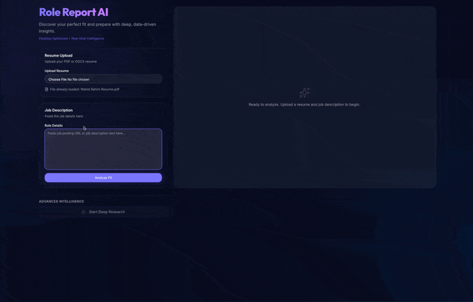
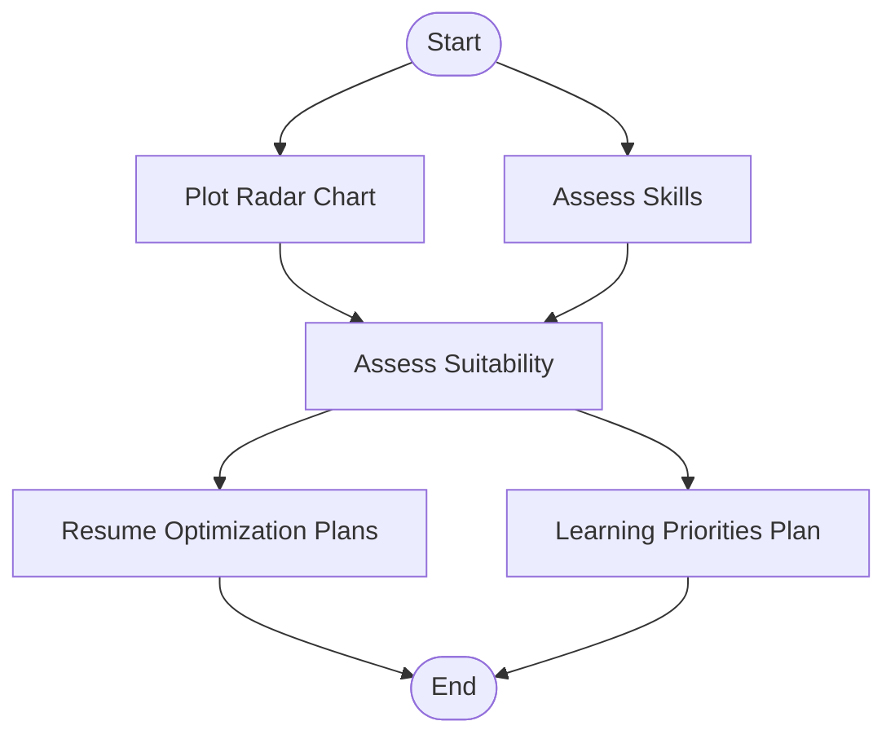

# Role Report AI

[role-report-ai.vercel.app](https://role-report-ai.vercel.app/)

A technical exploration of orchestrating multi-step LLM workflows with LangGraph, paired with a streaming UI (SSE + ReadableStreams). It compares a resume against a job description to generate a fit analysis and recommendations, and can optionally conduct deeper research to produce company/job context and interview prep guides.

## Analyze Fit

## Deep Research

## Analyze Fit Workflow

This workflow orchestrates a preliminary resume-job fit analysis by visualizing skill alignments through a radar chart and conducting parallel skill assessments. These insights feed into a suitability evaluation that determines overall compatibility, then branches into actionable outputs: tailored resume optimization recommendations and structured learning priority plans.

## Deep Research Workflow 🚧

This workflow conducts comprehensive company and role intelligence gathering, continuing from the preliminary analysis. It begins with automated extraction of key details, then strategically plans research queries, executes web searches, and reviews results with possible iterations. The process generates practical interview preparation guides and detailed research reports providing contextual understanding beyond the job description.

## ✨👨‍💻 Vibe Code Disclaimer

This project was built as an exercise in constructing LLM orchestrations with LangGraph, plus building streaming UIs using SSE and ReadableStreams. The core focus is the backend AI workflow architecture; the client-side UI styling was almost entirely "vibe coded" after the data pipelines and streaming mechanics were in place. This is not meant to be a polished, production-ready application yet, but rather a technical exploration of how to orchestrate multi-step AI workflows with structured, predictable execution.
