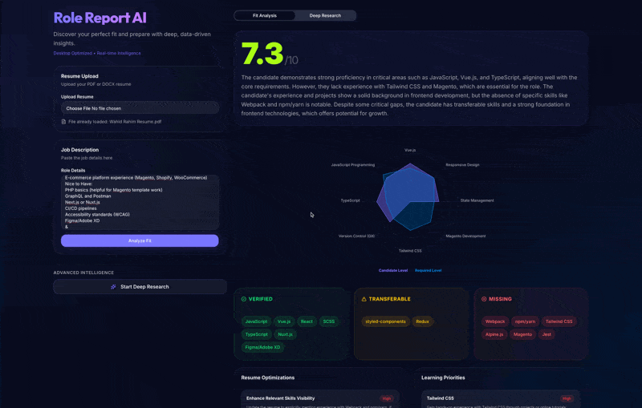
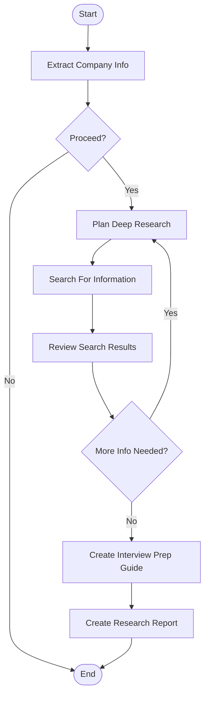

# Role Report AI

[role-report-ai.vercel.app](https://role-report-ai.vercel.app/)

A technical exploration of orchestrating **multi-step LLM workflows** with **LangGraph**, paired with a **streaming UI** (SSE + ReadableStreams).

At a high level, Role Report AI:

- Compares a resume against a job description to generate a fit analysis + recommendations
- Can optionally go deeper and produce company/role context and interview prep artifacts

## Demos

### Analyze

### Deep Research

## Workflows

### Analyze Workflow

This workflow orchestrates a resume ↔ job fit analysis by visualizing skill alignment (radar chart) and running parallel skill assessments. Those insights roll up into a suitability evaluation, then branch into actionable outputs: tailored resume optimization recommendations and structured learning priority plans.

### Deep Research Workflow 🚧

This workflow continues from the preliminary analysis to do broader company/role intelligence gathering. It starts by extracting key details, then plans research queries, executes web searches, and reviews results (with iterative loops if needed). The workflow outputs practical interview prep guides and a detailed research report that adds context beyond the job description alone.

## ✨👨‍💻 Vibe Code Disclaimer

This project was built as an exercise in constructing LLM orchestrations with streaming UIs. The core focus is the backend AI workflow architecture; the client-side UI styling was almost entirely "vibe coded" after the data pipelines and streaming mechanics were in place. This is not meant to be a polished, production-ready application yet, but rather a technical exploration of how to orchestrate multi-step AI workflows with structured, predictable execution.
